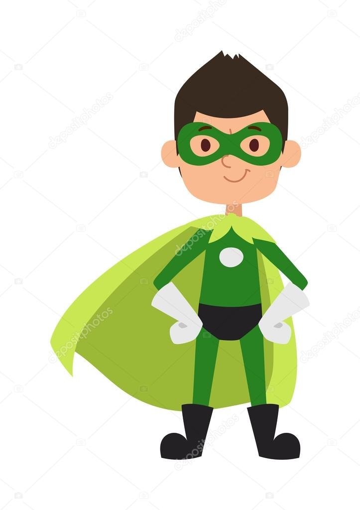

# Nature boy

 Always loving nature and studying its powers, this little boy was blessed in this way.
 The four fundamental natural elements(water,fire,earth,wind) are in hisarms and he is able to control them in different ways. 
 These blessings are evolving durind the confrontations in time.

## Powers and weaknesses

- ➕ Can create waves
- ➕ Has fire sword
- ➕ Creates typhoon
- ➕ Rises up earth shield
- ➖ Gets tired quickly because of the amount of the consumed energy
