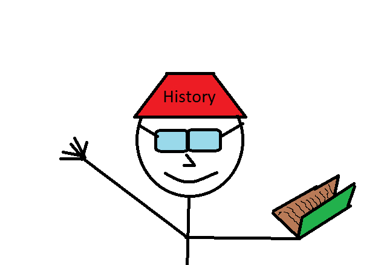

# The History Guy

The history guy was a normal guy until he entered an okd Victorian cursed library. He opened an old dusty book that turned out to be cursed. Now he is immortal and can travel back in time, but never back to the future, so he has to wait for the passing of the time to get back to the present time. 

## Powers and weaknesses
 
- ➕ He can travel back in time;
- ➕ He is immortal;
- ➕ He can alter the past; 
- ➖ Can't travel to the present once he traveled back in time;
- ➖ He doesn't know how his actions in the past will affect the future.