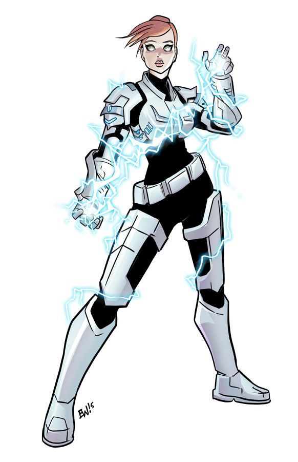

# The Lightning Queen

Having gone through the trauma of her life at a young age, Jessa Williams
becomes "The Lightning Queen", a heroine who has control over electricity.

## Powers and weaknesses

- ➕ Always wears an armour for protection
- ➕ Can travel easily and super-fast through electrical circuits. 
- ➕ Hard to catch
- ➖ Needs a lot of practice to control her powers and are very tiring to use