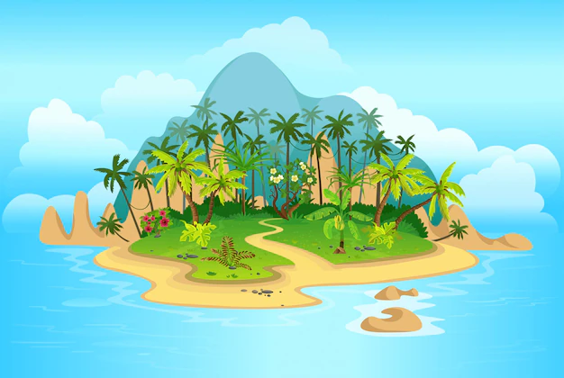

# Teens Magic Island

During the summer holiday, two 15-year-old best friends being called Jack Johnson and George Smith decide to go to a remote island
wihout parents' consent by Johnsons' boat. Arrived there, while exploring the island, an odd animal attack Jack so that he dicovers
a hidden door by hitting a stone. The two guys come into that space that was, in fact, an impressive laboratory by technology.
After the assistant remarks the children, total chaos enssues so that, following the contact of the animal's saliva with the substance produced by the doctor
the assistant and the children are getting super power, but doctor. All the time, the doctor has not being found the x element for
having the much desired powers. The only aim of the doctor is to kill the kids wih the aid of his assisnat and finally him.
So, the village where the kids live is in danger. From now Jack will be Chop Boy and George Nature boy.
