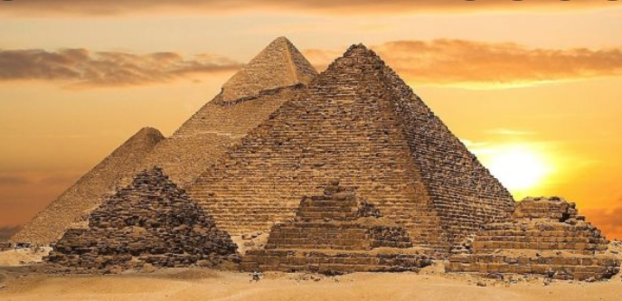

# The Battle of Time

From the first moment the history guy traveled back in time, back to The Old Kingdom of Egypt, the Laws of Nature felt a disturbance in the order of things. They are determinated to stop the history guy and others like him that mess with the order of the natural world, even if they are doing it for the better or wrose.
Guess what, the pyramids are now upside down because the history guy tripped on a stick near Khufu's pyramid. In his defense, he traveled back in time and fixed it, but now Atlantropa is a thing though, so everything's messy). Good luck fixing the time History Guy!

## Characters

- [The history guy](../heroes/the-history-guy.md)
- [The laws of nature](../villains/the-laws-of-nature.md)
