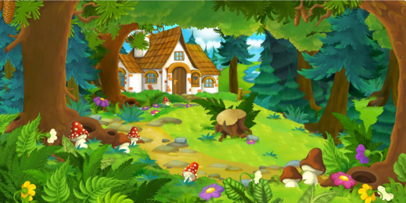

# The Forest With Soup

In a deep dark forest is a abandoned house. A hero by his name Nature Boy found it while picking mushrooms, he is very curious about what is inside it so he approaches the door and opens it.
Inside there is old furniture forgotten for years, but also a strange smell coming from the kitchen. It was Mushy Ciorbi who has that smell, and our hero Nature Boy was very hungry because he had already been picking mushrooms for 5 hours.
So our hero thinks about eating the infectious soup. After a period of 5 minutes in which our hero was thinking about whether to eat the soup, he eats it and turns into a zombie. However, Supic La Plic hears what happened and tries to save Nature Boy from the infection. It is the only soup that can cure the infection and poiseness from the Mushy Ciorbi. 
In the end, Supic La Plic manages to convince Nature Boy to eat him, and he sacrificed himself for the life of the hero of nature, finally becoming the hero himself.

## Characters

- [Nature Boy](../heroes/nature-boy.md)
- [Supic La Plic](../heroes/supic-la-plic.md)
- [Mushy Ciorbi](../villains/mushy-ciorbi.md)