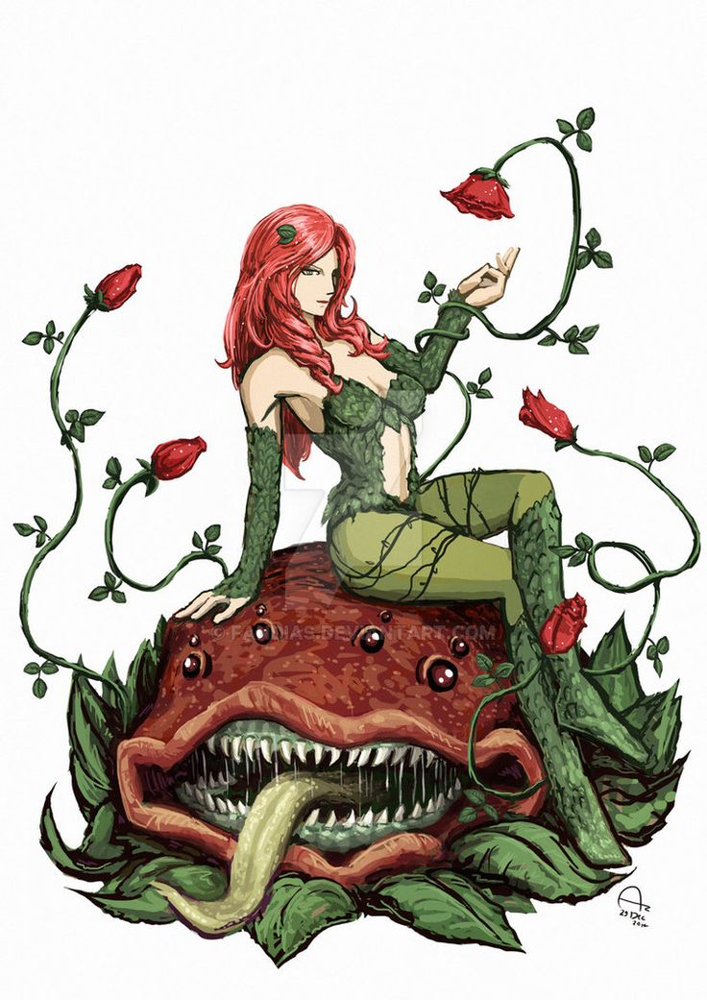

# Photosynthia

A long time ago, she was a simple girl with a huge passion for plants, a passion that became an obsession, which nowadays has become pure madness.
Photosynthia hates everything and everyone and her main goal is to turn every creature into stone using her ability. 

## Powers and weaknesses

- ➕ She can turn everything she scratches into stone (even with the roots).
- ➕ She can use plant roots to capture everything she wants. 
- ➕ Hard to kill because she can use the plants as a shield.
- ➖ Cannot survive without 2L of water per day.  
