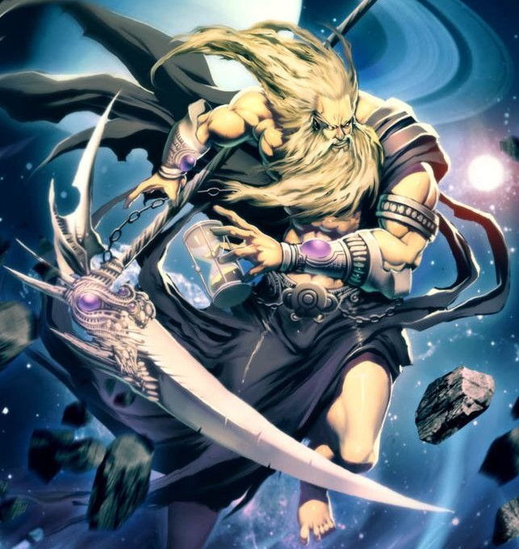

# Titan Cronus

One of the many children of Gaia and Uranus, the first Titan, the leader of the first generation of Titans.

## Powers and weaknesses

- ➕ His skin is made of granite
- ➕ The strongest of the titans
- ➕ It is a 30 meters giant
- ➖ Disadvantage, he often betrays his brothers